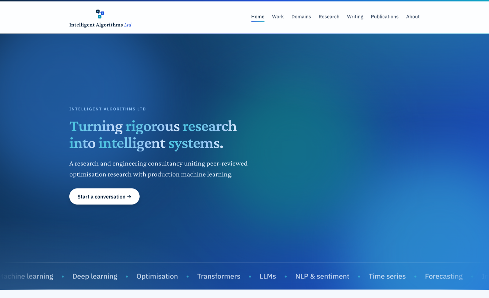

<div align="center">


<h1>Intelligent Algorithms <em>Ltd</em></h1>

<p><strong><em>Turning rigorous research into intelligent systems.</em></strong></p>

<p>A research and engineering consultancy uniting peer-reviewed<br>
optimisation research with production machine learning.</p>

<p><a href="https://intelligent-algorithms.co.uk/"><strong>intelligent-algorithms.co.uk&nbsp;&rarr;</strong></a></p>

<br>

<a href="https://intelligent-algorithms.co.uk/"></a>

</div>

---

## About this repository

Source for the Intelligent Algorithms Ltd website — a static site (HTML and
CSS, no build step) deployed via **GitHub Pages** to
[intelligent-algorithms.co.uk](https://intelligent-algorithms.co.uk/).

## Pages

| Page | File |
| --- | --- |
| Home | `index.html` |
| Work | `work.html` |
| Domains | `domains.html` |
| Research | `research.html` |
| Writing | `writing.html` |
| Publications | `publications.html` |
| About | `about.html` |

## Running locally

Open any `.html` file directly in a browser, or serve the folder:

```sh
python3 -m http.server
```

Then visit <http://localhost:8000>.

## Structure

- `assets/style.css` — all styling (blue palette, responsive layout)
- `assets/logo.svg` — the connected-boxes brand mark
- `assets/main.js` — scroll-reveal progressive enhancement
- `CNAME` — custom-domain configuration for GitHub Pages
